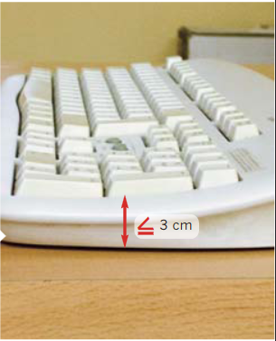
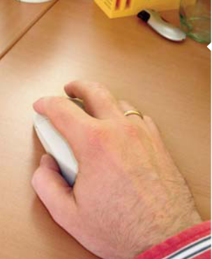

# Elementos de trabajo
## Teclados y ratones

### *Teclado*

Para reducir los giros de las muñecas son aconsejables los nuevos diseños de teclados (orientados en ángulos), bien sean partidos o de una única pieza.

Es recomendable que haya unos 10 cm de distancia entre el borde de la mesa y el teclado para poder apoyar las manos y los antebrazos.

### *Ratón*

El ratón tiene que ser adecuado al tamaño de la mano, de esa manera no se fuerza la inclinación de la muñeca.

> Adaptar la velocidad del cursor del ratón según la habilidad del usuario. Los expertos pueden preferir mayor velocidad, pero esto requiere movimientos más precisos.

# Configuración del puesto
La disposición de tu puesto de trabajo puede ser causa de problemas mayores a largo plazo pues estar en determinadas posiciones o no usar ciertos elementos te puede accarrear un daño.

## 🪑Sillas
Al estar sentados durante **mucho tiempo**, el tipo de silla es muy importante, por eso es importante disponer de sillas que permitan libertad de movimiento, por lo tanto con ruedas, que sea estable, y con cinco apoyos.

Ajustar en altura el asiento, de forma que al apoyar la muñeca sobre el borde de la mesa, el brazo se mantenga pegado al tronco y el brazo y el antebrazo formen un ángulo de 90º. Además, el muslo y la pierna también deben formar un ángulo de 90º, teniendo que tener apoyados los pies en el suelo. Si esto no es posible, utiliza reposapiés.

## 🦿Reposapies
Un reposapiés bien diseñado y ajustable puede ayudar a mantener una postura **más erguida**, reducir la presion de los pies, descansarlos en un lugar cómodo, y **mejorando** la circulación sanguínea de los pies.

## 🫳Reposmuñecas
Los reposamuñecas son accesorios diseñados para **proporcionar apoyo y comodidad a la zona de la muñeca** y la mano mientras se utiliza un teclado o un ratón. Al igual que con los pies, reduce su presión, previene las lesiones por esfuerzo repetitivo y mejora la postura.

> Estos son algunos elementos importantes a tener en cuenta a la hora de estar sentado demasiado tiempo frente a un ordenador. También son importantes las posturas, pues teniendo una buena postura podemos evitar problemas en la espalda o evitar el síndrome del túnel carpiano.