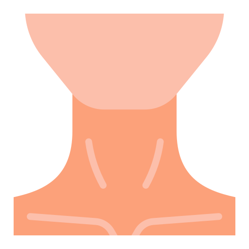
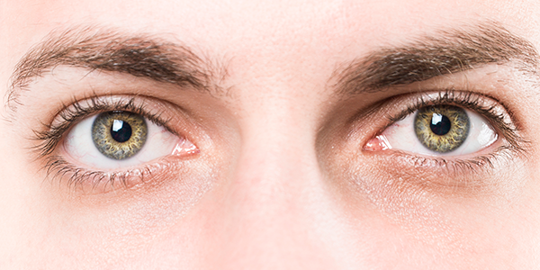
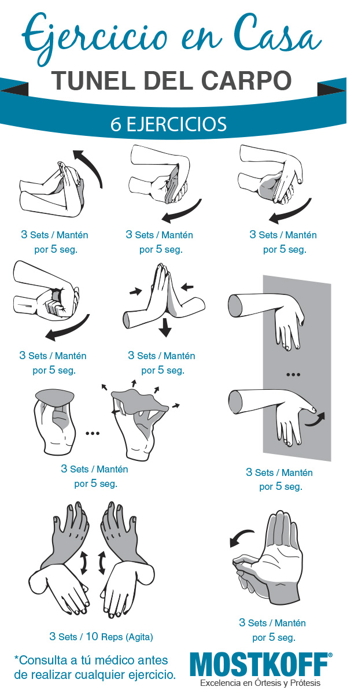

# Elementos de trabajo
## Teclados y ratones

### *Teclado*

Para reducir los giros de las muñecas son aconsejables los nuevos diseños de teclados (orientados en ángulos), bien sean partidos o de una única pieza.

Es recomendable que haya unos 10 cm de distancia entre el borde de la mesa y el teclado para poder apoyar las manos y los antebrazos.

### *Ratón*

El ratón tiene que ser adecuado al tamaño de la mano, de esa manera no se fuerza la inclinación de la muñeca.

> Adaptar la velocidad del cursor del ratón según la habilidad del usuario. Los expertos pueden preferir mayor velocidad, pero esto requiere movimientos más precisos.

# Configuración del puesto
La disposición de tu puesto de trabajo puede ser causa de problemas mayores a largo plazo pues estar en determinadas posiciones o no usar ciertos elementos te puede accarrear un daño.

## 🪑Sillas
Al estar sentados durante **mucho tiempo**, el tipo de silla es muy importante, por eso es importante disponer de sillas que permitan libertad de movimiento, por lo tanto con ruedas, que sea estable, y con cinco apoyos.

Ajustar en altura el asiento, de forma que al apoyar la muñeca sobre el borde de la mesa, el brazo se mantenga pegado al tronco y el brazo y el antebrazo formen un ángulo de 90º. Además, el muslo y la pierna también deben formar un ángulo de 90º, teniendo que tener apoyados los pies en el suelo. Si esto no es posible, utiliza reposapiés.

## 🦿Reposapies
Un reposapiés bien diseñado y ajustable puede ayudar a mantener una postura **más erguida**, reducir la presion de los pies, descansarlos en un lugar cómodo, y **mejorando** la circulación sanguínea de los pies.

## 🫳Reposmuñecas
Los reposamuñecas son accesorios diseñados para **proporcionar apoyo y comodidad a la zona de la muñeca** y la mano mientras se utiliza un teclado o un ratón. Al igual que con los pies, reduce su presión, previene las lesiones por esfuerzo repetitivo y mejora la postura.

> Estos son algunos elementos importantes a tener en cuenta a la hora de estar sentado demasiado tiempo frente a un ordenador. También son importantes las posturas, pues teniendo una buena postura podemos evitar problemas en la espalda o evitar el síndrome del túnel carpiano.

 # Elementos psicosociales
 
Los riesgos en el trabajo pueden afectar la salud de las personas de manera difícil de reconocer. Esto puede causar problemas como **desmotivación**, **insatisfacción laboral**, **estrés y ausencias**. 
A menudo, se ve como un problema personal en lugar de ser causado por un mal diseño del trabajo o una organización deficiente.

Para ello seguiremos algunas normas y consejos:

## Técnicas de enriquecimiento del trabajo

cambiar las tareas es decir tener una **variedad de tareas** para no estar quieto, por ejemplo: Desmontar un ordenador,moverte por el area de trabajo,atender al publico,etc. Esto ayuda a cambiar la postura y descansar, lo cual es crucial para **reducir problemas musculoesqueléticos** sobre todo para un informatico que pasa gran parte de su tiempo sentado.

## Asignacion de tiempo a las tareas

Una **buena organizacion** de tiempo ayuda no estresarse durante las tareas y poder finalizarlas a tiempo, lo cual es bueno ya que no recibes **estres constante** y puedes tomar **descansos**

## Fomentar el trabajo en equipo

Facilitar el intercambio de conocimientos entre el personal empleado con distintos grados de experiencia, trabajar en grupo para solucionar problemas de manera mas tranquila y eficiente,.

## Promover prácticas de Responsabilidad Social Corporativa (RSC)

Conciliación de la vida familiar, horarios flexibles, respeto al medio ambiente y la eliminación de la discriminación de género. Estas acciones resultan en un aumento de la satisfacción dentro de la organización.

# Ejercicios musculares

Son buenos para poder tener una buena salud fisica y minimizar el riesgo de tener problemas musculares y esqueleticos.

ademas de que en el ambito de la informatica viene muy bien descansar de vez en cuando tambien viene bien levantarse y dar un paseo

pero para mejor salud es recomendable hacer algunos ejercicios como los siguientes:

## Espalda 

1. Coloca las manos detrás
de la cabeza llevando los
codos hacia atrás y acercando los omoplatos.

2. Siéntate con la columna
recta y contrae los abdominales empujando la zona lumbar hacia el respaldo.

[Estiramientos espalda](https://www.youtube.com/watch?v=CPjhyTWNUI4)

[Estiramientos cervicales](https://www.youtube.com/watch?v=NEqp5YXLhs8)

## Cuello

1. Inclina la cabeza lentamente hacia arriba y hacia
abajo.
2. Inclina la cabeza lentamente de derecha a izquierda y de izquierda a derecha.

[Estiramientos cuello](https://www.youtube.com/shorts/GL0wcthrBdw)

## Ojos

1. Relaja los ojos cerrándolos durante un tiempo o
mirando a un lugar alejado.

2. Mueve los ojos en todas
las direcciones alzando las
cejas.

## Manos y Muñecas

unos ejercicios importantes para todo informatico son los estiramientos de muñecas para prevenir el tunel carpiano,
ademas de la tabla con ejercicios teneis estos enlaces a algunos videos para hacer estiramientos

[Estiramientos tunel carpiano](https://www.youtube.com/watch?v=x_4xVFqDEuQ&t=109s)

## Informacion sacada de estas paginas

[enlace1](https://evalart.com/es/blog/psychosocial-risk-at-work-and-nom035/)

[enlace2](https://www.ticarte.com/sites/su/users/7/arch/prevencion-riegos-laborales-informatica-comunicaciones.pdf)

[enlace3](https://www.aeot.es/rsc-responsabilidad-social-corporativa/)
