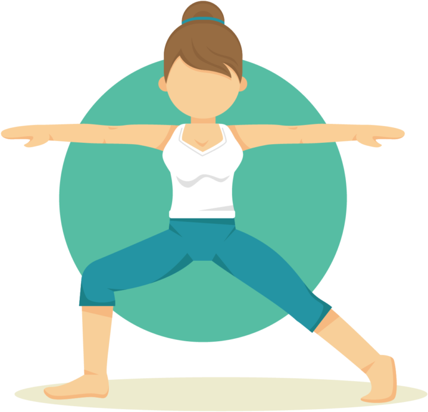

# Elementos importantes en el puesto
La disposición de tu puesto de trabajo puede ser causa de problemas mayores a largo plazo pues estar en determinadas posiciones o no usar ciertos elementos te puede accarrear un daño.

## Sillas
Al estar sentados durante mucho tiempo, el tipo de silla es muy importante, por eso es importante disponer de sillas que permitan libertad de movimiento, por lo tanto con ruedas, que sea estable, y con cinco apoyos.

## Reposapies
Un reposapiés bien diseñado y ajustable puede ayudar a mantener una postura más erguida, reducir la presion de los pies, descansarlos en un lugar cómodo, y mejorando la circulación sanguínea de los pies.

## Reposmuñecas
Los reposamuñecas son accesorios diseñados para proporcionar apoyo y comodidad a la zona de la muñeca y la mano mientras se utiliza un teclado o un ratón. Al igual que con los pies, reduce su presión, previene las lesiones por esfuerzo repetitivo y mejora la postura.

>Estos son algunos elementos importantes a tener en cuenta a la hora de estar sentado demasiado tiempo frente a un ordenador. También son importantes las posturas, pues teniendo una buena postura podemos evitar problemas en la espalda o evitar el síndrome del túnel carpiano.

 # Elementos psicosociales
 
Los riesgos en el trabajo pueden afectar la salud de las personas de manera difícil de reconocer. Esto puede causar problemas como **desmotivación**, **insatisfacción laboral**, **estrés y ausencias**. 
A menudo, se ve como un problema personal en lugar de ser causado por un mal diseño del trabajo o una organización deficiente.

Para ello seguiremos algunas normas y consejos:

## Técnicas de enriquecimiento del trabajo

cambiar las tareas es decir tener una **variedad de tareas** para no estar quieto, por ejemplo: Desmontar un ordenador,moverte por el area de trabajo,atender al publico,etc. Esto ayuda a cambiar la postura y descansar, lo cual es crucial para **reducir problemas musculoesqueléticos** sobre todo para un informatico que pasa gran parte de su tiempo sentado.

## Asignacion de tiempo a las tareas

Una **buena organizacion** de tiempo ayuda no estresarse durante las tareas y poder finalizarlas a tiempo, lo cual es bueno ya que no recibes **estres constante** y puedes tomar **descansos**

## Fomentar el trabajo en equipo

Facilitar el intercambio de conocimientos entre el personal empleado con distintos grados de experiencia, trabajar en grupo para solucionar problemas de manera mas tranquila y eficiente,.

## Promover prácticas de Responsabilidad Social Corporativa (RSC)

Conciliación de la vida familiar, horarios flexibles, respeto al medio ambiente y la eliminación de la discriminación de género. Estas acciones resultan en un aumento de la satisfacción dentro de la organización.

# Ejercicios musculares

Son buenos para poder tener una buena salud fisica y minimizar el riesgo de tener problemas musculares y esqueleticos.

ademas de que en el ambito de la informatica viene muy bien descansar de vez en cuando tambien viene bien levantarse y dar un paseo

pero para mejor salud es recomendable hacer algunos ejercicios como los siguientes:

## Espalda 

1. Coloca las manos detrás
de la cabeza llevando los
codos hacia atrás y acercando los omoplatos.
2. Siéntate con la columna
recta y contrae los abdominales empujando la zona lumbar hacia el respaldo.

## Cuello

1. Inclina la cabeza lentamente hacia arriba y hacia
abajo.
2. Inclina la cabeza lentamente de derecha a izquierda y de izquierda a derecha.

## Ojos

1. Relaja los ojos cerrándolos durante un tiempo o
mirando a un lugar alejado.

2. Mueve los ojos en todas
las direcciones alzando las
cejas.

---------------------------
Esto es como wikipedia[^1]

[^1]: Hola asdasdasd

