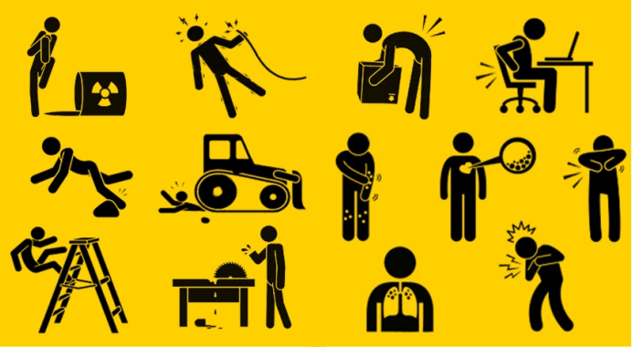

# RIESGOS LABORALES

## 1. ¿Qué son?
Son aquellas circunstancias que pueden producir un peligro en el desarrollo de una actividad provocando un accidente.

Estos factores de riesgo dependen mucho del tipo de trabajo en el que se desempeñen, ya que los daños que causan son de una gravedad diferente. Por ejemplo, no es lo mismo el riesgo laboral que tiene un técnico informático que un albañil de obras de grandes estructuras. En el primer caso puede ocurrir algo como un tropiezo con el mobiliario que tiene un peligro muy bajo, en cambio, en el segundo caso el hecho de no llevar casco puede conllevar a que la gravedad sea mucho mayor.

## 2. Factores de riesgo:
* **Local de trabajo:** Instalación eléctrica, instalación de gas, prevención de incendios, ventilación, temperaturas, etc.
* **Organización del trabajo:** Administrar la carga física y/o mental, organizar y planificar el trabajo, la monotonía, la ausencia de creatividad, el aislamiento, etc.
* **Tipo de actividad:** En este factor lo que influye los equipos de trabajo que se utilicen como la labor que realizan.
* **Materias primas:** Materiales inflamables, productos químicos, etc.

## 3. ¿Comó evitarlos?
Estos accidentes causados por los riesgos laborales pueden evitarse o reducir su impacto tomando una serie de precauciones. También es cierto que las empresas deben de tener previsto todos esos peligros que pueden suceder creando un plan de prevención de riesgos laborales, con una serie de protocolos para poder prevenirlos y saber como actuar en caso de que se produzca algún accidente.

A día de hoy las empresas cubren a sus trabajadores con seguros médicos para cubrir esos accidentes, y muchas de ellas contratan a un profesional cuya función es cuidar la higiene y la seguridad del lugar de trabajo.

# REFERENCIAS
[www.beedigital.es](https://www.beedigital.es/prevencion-riesgos/que-es-el-riesgo-laboral-definicion-y-como-evitarlo/)

[www.isotools.us](https://www.isotools.us/2015/09/10/riesgo-laboral-definicion-y-conceptos-basicos/)
